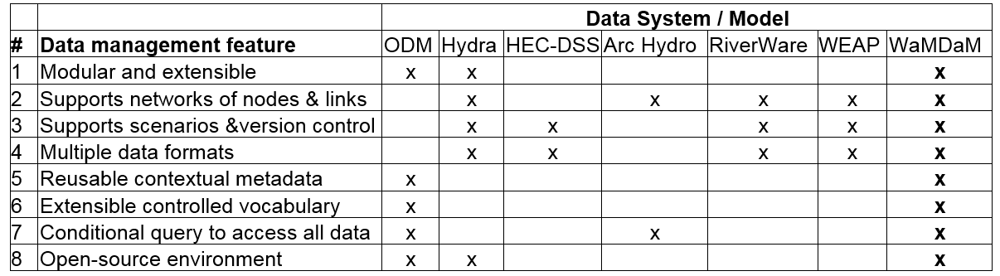
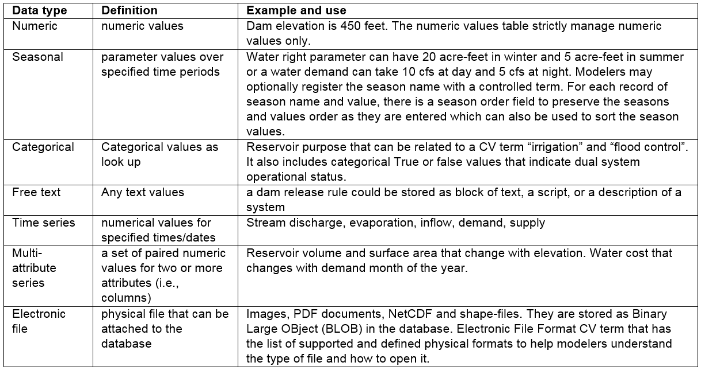

# Design Requirements: Synthesis of Prior Approaches 

## Questions
We identified six different example use cases to guide the design of WaMDaM, demonstrate its capabilities, and define its objectives. The use cases focus on a user’s perspective where each one is standalone but they complement each other. The use cases, although not inclusive to all possibilities, represent an attempt to cover important and key aspects of the domain of models’ data requirements, supply, demand, and infrastructure, connectivity, and scenario comparisons. We draw details on the current practices and use cases to organize data from literature, from our research group experience, and informal conversations with collaborators and stakeholders.   

The overarching goal of the use cases is to demonstrate how WaMDaM as a one method enables systematic data query and comparisons across multiple different models and datasets. The ability to perform systematic comparisons across overlapping datasets in a study area is fundamental to data analysis (Caramani, 2009). We provide the use cases in the form of specific questions as examples to avoid abstraction, but they are intended in principle to apply to other models, attributes, and components as we explain throughout the paper and in Section 4. The specificity here applies to example models and systems components in a selected study area within any selected geo-spatial boundary as discussed later. 

**The use cases are:**  

1.	What are the data availability in WaMDaM database for attributes needed to develop a WEAP and WASH models in the Bear River Watershed, USA?

2.	What is the water supply flow at the site below Stewart Dam in Idaho?

3.	What is the water demand for agriculture in Cache County, Utah?

4.	What are the purpose (s), volume and elevation curve of Hyrum Reservoir, Utah? what is the source of data?

5.	What are the natural and built infrastructure that are connected to Hyrum Reservoir, Utah?

6.	What are the differences in network topology, metadata, and input data between the two scenarios within the WEAP and BRSDM Bear River models?

Answering these questions using the existing methods requires many datasets, manual data manipulations that often cannot be reused for other datasets, and thus takes considerable effort and time. Satisfying these use cases is the top design priority while other potential different use cases can be addressed in future work based on users’ experiences. Next we elaborate on our methodology in revering existing systems as a basis to synthesize their strengths into a WaMDaM design. 

## Synthesis of design features 

Reviewing existing data management systems like the mentioned above revealed that they support one or some of the features that would allow water managers to organize and compare water management data across multiple sources and models, but no existing method supports all features (Table 1)

Together, the following eight features can constitute design requirements for a new information model to organize water management data for multiple datasets and models. First, the new method needs to support different water resources systems components that are used in water management models like hydrology, infrastructure, and demand sites as reusable modules or sets of systems components. Second, the method must represent connectivity and interactions between components in space through networks of nodes and links as used in systems modeling. Third, the method must support scenarios that track topologic and data values changes in networks. Fourth, it must support multiple data types that are used in systems modeling like time series and multidimensional arrays. Fifth, it must use consistent contextual metadata to unambiguously interpret data values. Sixth, it must use controlled vocabulary to relate inconsistent terms across data sources and models. Seventh, it must enable conditional data queries to access and compare subsets of data and metadata, and eighth, the method must be developed in an open-source software environment. 

**Table 1:** The identified requirements that are supported by select data systems and water resources models for a method to organize and prepare data for multiple datasets and models. An “x” indicates that the feature is supported. WaMDaM is designed to support all of the features
			

## Features in details
### Feature 1
Representing multiple systems components like reservoirs and demand sites in reusable data modules would allow researchers to define water system components as objects (i.e., classes) with properties to describe their qualitative or quantitative data (Connolly and Begg, 2010; Wurbs, 2012; Zagona et al., 2001). This representation would then allow users to reuse or add new objects to their model, which makes it an extensible data model design (Connolly and Begg, 2010; Goodall et al., 2011; Kokkonen et al., 2003; Pokorný, 2006). Most of the reviewed systems and water management models have this modular design but often it is limited to a pre-defined set of supported object types. Thus having a modular and extensible design would allow adding or removing modules based on each model’s data need. 

### Feature 2  
In the second feature, networks connect node and link representations of systems components in two dimension in space. We use the notion of node as equivalent to a junction or point, and a link as equivalent to arc, connection, curve, line, or an edge as used in different software (HydroLogics, 2009; Rossman, 2000; Zeiler, 1999). Vertex is a type of node that changes the spatial layout of a link but keeps it as one link. Networks help users to organize and then search groups of system components that are related for a purpose (e.g., flow of water through connected pipes) for a particular domain (e.g., drinking water supply) in a specific spatial boundary (Loucks et al., 2005). Most of the reviewed systems support creating instances of their object types, and adding links that connect nodes but it is out of the scope of some models.

### Feature 3
Scenarios track changes in networks for a specific physical, operation, and socio-economic configuration of a systems model which are like versions of the network and its data. A scenario represents one or more of potentially three changes to a network: i) change in topology like adding or removing an infrastructure component, ii) change in metadata like changing a method or data source of an attribute values, iii) or changing data values for one or more component attributes. Many of the reviewed systems have the ability to support scenarios but none of them support the three identified types of scenarios changes. 

### Feature 4
Metadata provides ancillary information to help interpret data values of components’ attributes. Metadata also helps users maintain the data provenance that is needed to track the history and context of data of  i) sources, ii) methods, iii) people and iv) organizations that contributed to create a data value (Campbell et al., 2013; Carata et al., 2014; DCMI, 2013; Goodman et al., 2014; Gray et al., 2005; Horsburgh et al., 2008; Pokorný, 2006). Most of the reviewed systems support adding some metadata but often it is either completely optional or not supported explicitly under those four categories. 

### Feature 5    
Controlled vocabularies (CVs) are often a set of agreed upon terms for attributes with definitions that users can use to relate with synonyms across data sources for different networks (Laniak et al., 2013). The only common CVs system that exists for the water resources community was proposed in the ODM and then adopted by CUAHSI. http://his.cuahsi.org/mastercvreg/cv11.aspx). Relating water management datasets at a basic level would need controlling the Object Type, Attribute Name, and Instance Name. The CUAHSI CVs supports two main types of CVs that would overlap with WaMDaM. The Site Type in CUAHSI is equivalent to Object Type in WaMDaM and the Variable Name is equivalent to Attribute Name in WaMDaM. The water management terms in datasets and models for Object Types and Attributes can be more specific than what is used for observational purposes in CUAHSI. For example, CUAHSI has one CV Site Type term for “Lake, Reservoir, Impoundment” where in water management, each of the sub names in the term has different purpose in the context of water management. WaMDaM uses “attribute” as it extends beyond the often quantitative time series data as in CUAHSI to include qualitative of descriptive data as explained later in Section 3. One additional CV type that is needed in WaMDaM is the ability to control the Instance name which is equivalent to the uncontrolled field in CUAHSI for site code. Later we suggest expanding the CUAHSI CVs system to support water management terms. 

### Feature 6    
Data of systems modeling often consist of multiple types that represent physical, operational, and descriptive attributes of components: time series, multi attribute series (i.e., arrays or multi-dimensions), numeric and descriptor parameters, seasonal parameters, and binary dual values (Table 2). We keep in mind that an attribute may apply to all the network components as one global attribute or to each, one-at-a-time as local attribute to one component. For example, a time series of inflow applies to one reservoir component while the same time series of evaporation applies to all the reservoirs in the network. We selected those prominent data types for our use cases and we recognize there are more complex data types for future work like rules or formulas which associate multiple attributes with mathematical symbols. These data types are not exhaustive of what is used in systems models but they satisfy the identified use cases and data sources and models in this study. We require the design to be flexible to address adding or removing data types. Many of the reviewed systems support these data types but they fall short in other design requirements of having structured metadata to describe them. They may also have limited ability to readily allow users a conditional query and access all the data values. One significant improvement WaMDaM would contributes over the CUAHSI data system is the ability to organize multi attribute series or arrays which are pervasive in water management data. 

Table 2: Selected data types, their definitions, and examples in water resources systems models
			

### Feature 7    
Conditional data queries support the loading and retrieval of subsets of data based on selected water system components, attributes, metadata, networks, scenarios, and data types in space and time, without the need for a third party software. Thus, conditional queries enable users to query, synthesize, and compare subsets of water management data and use them in models. Many of the reviewed systems have built-in functionality which limits the ability to freely query and compare data across the elements above. As mentioned in the next section, we choose the relational database theory for WaMDaM, in part to enable conditional data queries.  

### Feature 8  
We commit to using WaMDaM in a free and open-source software environment and publish its source-code in GitHub. Meeting this eighth requirement will allow liberal use of the code, promote reproducibility, and help others further advance the method (Easterbrook, 2014; Gil et al., 2016; Goodman et al., 2014).

