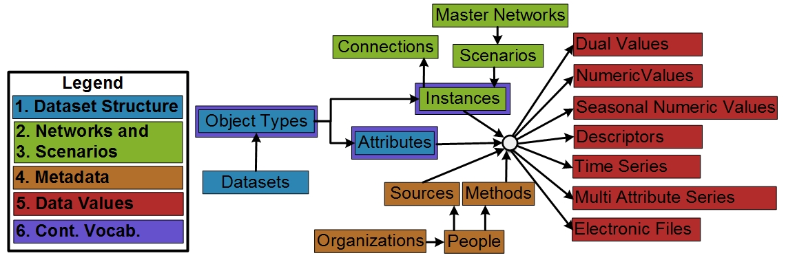

# WaMDaM Information Model

The Water Management Data Model (WaMDaM) is information model to organize water management data with contextual metadata and controlled vocabulary for multiple datasets and models. WaMDaM is implemented in a relational model and works for SQLite, MySQL, PostgreSQL, and Microsoft SQL Server. 

## Information Model Concepts and their description

**Figure 1**: Conceptual diagram of the water management information model constructs and their relationships within five groupings. Key controlled vocabulary will be introduced to the boxes outlined in purple. The “Category” box applies separately to group each of Object Types, Attributes, and Instances (not connected here for simplicity).  

### Dataset Structure  
A Dataset concept can associate with one or more Object Type concepts. An Object Type is a system component and can have one or more Attributes. An Attribute is quantitative or qualitative property that describes the Object Type. An Object Type can be later specified for a particular location as an Instance (e.g., Hyrum Reservoir). Users can define and customize as many combinations of Object Types and Attributes for models and datasets as they need without being limited to any predefined structure.   
  
Optionally, to group many Object Types that share a common classification, users may relate one or many Object Types into a defined Category. The Category defined here, is a simplistic grouping and can be used to query and filter a group of Object Types within the same Dataset. For example, a “supply” or “demand” Categories can group all its Objects. Similarly, for Attributes, “cost” and “Hydropower” can be used to group a set of attributes of an Object Type. A more sophisticated hierarchical grouping within the category itself (also referred to as ontology) (Uschold and Gruninger, 2004) is out of the scope of this work and maybe improved in future work to meet additional specific use cases. This capability to build data structures meets the first design requirement to be modular and extensible to represent systems components.  

### Networks  
In the Networks group (green), an Instance is a particular implementation of an Object Type and inherits its properties. An Instance may be geo-referenced as a node in space with longitude and latitude coordinates or as a link, that has start and end nodes as a Connection. We use the general concept of Instance to refer to nodes and links because both of them have similar descriptions except that the link must reference a start and end node. Many node and link Instances belong to a Scenario to represent a particular topological relationship (e.g., existing infrastructure, proposed). Many Scenarios can belong to a Master Network where a Network represents all the nodes and links that exist across its Scenarios (i.e., sub-networks). Similarly to Object Types and Attributes grouping, a Category can group a set of node or link Instances that share a common classification that is specific to some of the Object Type Instances but not all. For example, “Riverine” or “Floodplain” categories may apply to particular (not all) links of a stream Object Type as in the WASH model. Nodes, Links, and their Networks represent the second design requirement and Scenarios represent the third design requirement.  

### Metadata  
In the Metadata group (orange), metadata apply to each of the following three elements of water systems data: the Instance, Scenario, Attribute, and its Data Values. WaMDaM supports four essential key metadata to interpret data values i) the source of the element, ii) the method of creating the element and its type (e.g., measured, derived), iii) the organization and people who generate methods and serve as contact at sources. People and Organization for Sources might be different for Methods. For example, a data Source of United States Geological Survey (USGS) organization may use a Method defined by the Army Corps of Engineers organization, and iv) the unit of data values of an attribute. A unit is connected to an attribute at the Object Type level which enforces the same unit for an attribute of all instances. Thus, WaMDaM enforces unit consistency across instances of the same attribute as required by most of the reviewed models. A defined explicit structure of these metadata guides users to consistently document their metadata. A consistent metadata structure also helps users to access metadata directly and reuses it where applicable. These structured metadata satisfy the fifth design requirement.  

### Data Values
In the Data Values group (red), each Attribute for an Instance within a Scenario can have Data Values of any of the seven data types listed at the far right of (Figure 2). Data Values will be stored separately based on their data type to reinforce the persistency of the data model and guide users to only populate or query relevant data values. Persistency here means that data values are only stored and accessed in one place that does not change within the data model. Additional Data Types can be added (or removed) to the data model as a box, far right in (Figure 2) with no other changes  

### Controlled Vocabulary
In the controlled vocabularies group (purple), and sixth design requirement, optional vocabularies apply to the key concepts outlined in purple boxes in (Figure 2) to relate different terminology for similar Object Types, Attributes, and Instances across data sources and models. For example, the term “reservoir” could be used as a term that relates the “water body” and “dam” Object Types that originate from separate models and data sources: the “Waterbodies” from the USGS National Hydrography Dataset and the “Dams” dataset from the US Army Corps of Engineers. Thus, a query to search for “reservoir” will return the terms: reservoir, water body, and dam, as demonstrated in the first use case. 

