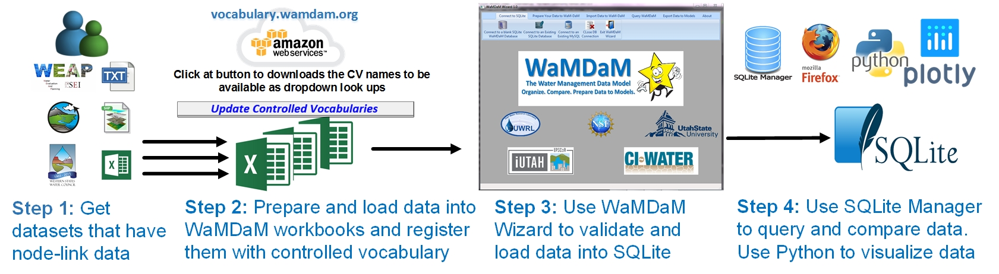

# Application
Demonstrate how WaMDaM enables systematic data query and comparisons across multiple different models and datasets. 

 
**Figure 1:** Flowchart of the steps that users follow to use WaMDaM   

### The Bear River Watershed, USA 
We demonstrate four use cases that assist modelers in activities to build water resources models 1) search in datasets for input data needed for a model in a study area, 2) analyze and compare data values to use in a model, 3) identify how the natural and engineered systems are connected and the directions of flow among them, and 4) identify and communicate differences for changes in network topology, metadata, and data values between modeling scenarios. 

We used the WaMDaM CVs, Workbook templates, and the WaMDaM Wizard to prepare and load thirteen US national, regional, and local datasets and models into a WaMDaM SQLite database. We integrate and compare the disparate datasets with a focus to assist modelers to analyze input data for models with a focus on the Bear River Watershed that spans three states, Utah, Idaho, and Wyoming (Figure 4; Table 3). The River begins in Utah, flows through Wyoming then Idaho, and ends as the largest source of water to the Great Salt Lake, Utah (UDWR, 2000).  

We prepared each dataset into an Excel Workbook template and registered example native terms with CVs. We then used the WaMDaM Wizard to populate all the data sources into a single WaMDaM SQLite database file on a local computer. The database file is 50 Megabytes with 60 Object Types, 455 Attributes, 16,000 instances, and 210,000 records in the central Mappings table. Once the disparate datasets were loaded into a WaMDaM database, we selected a few locations with water management significance in the Bear River Watershed to query and compare data reported from multiple sources.   

The locations included: 1) Stewart Dam in Idaho which represents the legal beginning of the Lower Bear River Division (Bear River Commission, 1980). Interestingly, the State of Utah datasets include Stewart Dam site in Idaho and the State of Idaho datasets include sites in the Lower Bear River in Utah which offer a good comparison opportunity like for the Stewart Dam, 2) Hyrum Reservoir which is an important facility to store irrigation water in Cache Valley, Utah, 3) Cache County, Utah which is a major water user in the Bear River Watershed, and 4) Flaming Gorge and Shasta large reservoirs outside the Bear River Watershed in Utah/Wyoming and California to verify that WaMDaM is scalable and applicable outside the Bear River Watershed.      

###Figure 2
   
**Figure 2** The Bear River Watershed in the Western US and example available data sources used to demonstrate WaMDaM. Use cases are for the entire watershed, Lower Bear, Cache County. Large stars from top to bottom are for sites referred to in use cases: Stewart Dam site, Hyrum Reservoir, and the Bear River Migratory Bird Refuge. 

## Datasets and models   
We loaded twelve different and models into a single WaMDaM database SQLite file. The datasets cover natural and built water supply and demand, infrastructure connectivity, with different data types, networks and scenarios that cover the WaMDaM capabilities. 
Each of the [datasets on GitHub][1] below is prepared and copied into a WaMDaM Excel workbook. Then we loaded all of them one-at-a-time into a single SQLite database file.

Table 1: Summary of example water management datasets used to demonstrate use cases to organize and compare heterogeneous and disparate data sources using WaMDaM to integrate them into a single WaMDaM SQLite database.   

## Download the SQLite file and SQLite Manager  
Follow the [steps](/UseCases/Download) here to use to execute the use cases next

## Use Cases in the Bear River Watershed, Utah 
The following presented use cases help users identify and compare two fundamental aspects of water management data: data values with different types and connectivity of scenarios and networks.  

**[Use case 1](use_case_1):** What data are available to develop a model in a particular watershed?  

**[Use case 2](use_case_2):** What differences are there across datasets in the data values of properties of a water system component?  

**[Use case 3](use_case_3):** How does connectivity of natural and built infrastructure components compare in a particular area across datasets? 

**[Use case 4](use_case_4):** What differences are there in network topology, metadata, and input data between two scenarios of a model instance? 

[1]: https://github.com/WamdamProject/WaMDaM_UseCases/tree/master/UseCases_files/1Original_Datasets_preperation_files

