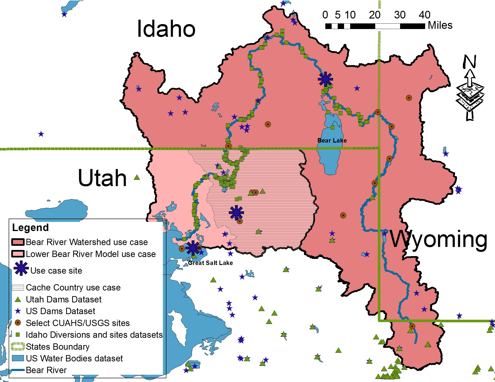

# Data Sources
Demonstrate how WaMDaM enables systematic data query and comparisons across multiple different models and datasets. 

 
**Figure 1:** Flowchart of the steps that users follow to use WaMDaM   

### Application: The Bear River Watershed, Utah 
We demonstrate the WaMDaM design and use cases using twelve data sources and models in the Bear River Watershed which spans three states, Utah, Idaho, and Wyoming. The Watershed covers an area 3,300 square miles (8,547 square kilometers) and it is the largest source of water to the Great Salt Lake in Utah.     

The Watershed is an interesting one because it has various unique and overlapping available data provided by the three states, the Bear River Commission, national US datasets, and three existing systems models: BRSDM which allocates water based on priority for the upper Bear River Basin, a WEAP model which allocate water on priority, and a WASH model which allocates water to maximum suitable habitat areas in the Lower Bear River.   

Note that when developers organize their model’s input data into WaMDaM, models become a new source of data. We select a few locations in the Watershed to demonstrate use cases as each location has data from multiple sources: Stewart Dam site in Idaho, Hyrum Reservoir, Bear River Migratory Bird Refuge, and Cache County in Utah which is a major water use area in the Bear River Watershed.   

 
**Figure 2**: The Bear River Watershed in the Western US and example available data sources used to demonstrate WaMDaM. Use cases are for the entire watershed, Lower Bear, Cache County. Large stars from top to bottom are for sites referred to in use cases: Stewart Dam site, Hyrum Reservoir, and the Bear River Migratory Bird Refuge. 

### Used datasets
We loaded twelve different and models into a single WaMDaM database SQLite file. The datasets cover natural and built water supply and demand, infrastructure connectivity, with different data types, networks and scenarios that cover the WaMDaM capabilities. 
Each of the [datasets on GitHub][1] below is prepared and copied into a WaMDaM Excel workbook. Then we loaded all of them one-at-a-time inton a single SQLite database file.

Table 1: Summary of example water management datasets used to demonstrate use cases to organize and compare heterogeneous and disparate data sources using WaMDaM 

## Download the SQLite file and SQLite Manager  
Follow the [steps](//UseCases/download.md) here to use to execute the use cases next

## Use Cases in the Bear River Watershed, Utah 
The following presented use cases help users identify and compare two fundamental aspects of water management data: data values with different types and connectivity of scenarios and networks.  

**[Use case 1](use_case_1):** identify data availability for attributes needed by a model in a study area. 
What attributes that have available data to develop a WEAP and WASH models in the Upper Bear River watershed?

**[Use case 2](use_case_2):** identify and compare time series and seasonal discharge data across data sources. 
What is the discharge at the node “below Stewart Dam” in Idaho?

**[Use case 3](use_case_3):** identify and compare demand data for a site as reported in many sources.
What is the total agriculture water use or demand in Cache Valley, Utah?

**[Use case 4](use_case_4):** identify and compare infrastructure data across many data sources. 
What is the volume, purpose, evaporation, and elevation of Hyrum Reservoir Utah?

**[Use case 5](use_case_5):** identify inflow and outflow into and out of a node water system component and compare them across data sources or models.
What is the inflow and outflow of Hyrum Reservoir, Utah? 

**[Use case 6](use_case_6):** compare differences in network topology and data values between two model scenarios.
What is the difference in input data between the two scenarios or the Bear River WEAP model?

[1]: https://github.com/WamdamProject/WaMDaM_UseCases/tree/master/UseCases_files/1Original_Datasets_preperation_files

